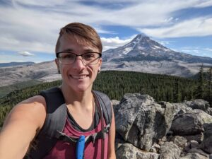

OPEN Northwest holds a board meeting roughly once a month, where the Board of Directors and members of the Executive Committee discuss the organization’s goals and how to reach them.  Community members are welcome at these meetings as well!  If you are interested in attending, please reach out to [volunteers@opennothwest.org](mailto:volunteers@opennothwest.org).

Below you will find more info on the Board of Directors and the members of the Executive Committee who are helping to steer our organization forward.

## Board of Directors

The Board of Directors are registered with the state and legally responsible for managing OPEN Northwest as a nonprofit organization.

### Treasurer - Nicholas Little

The Treasurer is the primary Legal Board Member responsible for monitoring and overseeing the financial well-being of the organization and upholding internal control practices that will support the organization in remaining in compliance with financial and regulatory requirements, as well as to support the organization’s growth and development in a financially sustainable manner on a forward-going basis.

Nick also serves as the Event Host coordinator for OPEN Northwest and hosts several of the organization’s regular events.

### Secretary - Sam W.

The Secretary is the primary administrative Board Member responsible for monitoring and overseeing the administration of the organization’s files, notes, schedules, and organizing practices in order to support the organization in remaining legally compliant and in good standing with its members.

## Executive Committee

The Executive Committee is made up of volunteers who have assumed ongoing responsibilities in the organization and report to the Board of Directors.

### Volunteer Coordinator - Tiffany K.

The Volunteer Coordinator helps connect community members who are interested in getting more involved with opportunities to help the organization and the community.  This role also aims to keep volunteers informed and up to date with what they need to know, and reaches out to the community when the organization has a particular need volunteers could help with.

### Technology Coordinator - David Gibbons

The Technology Coordinator guides our technical decisions and oversees our technology solutions such as our website, file share, and Discord server.

David also hosts some of OPEN Northwest’s regular events.

### Assistant Treasurer - Sherona Cheung

The Assistant Treasury’s function is to support the Treasurer in meeting their responsibility and commitments to the organization with regards to the financial well-being and maintaining internal control practices in support of, and safeguard, the organization.

Sherona also hosts several of OPEN Northwest’s regular events.
